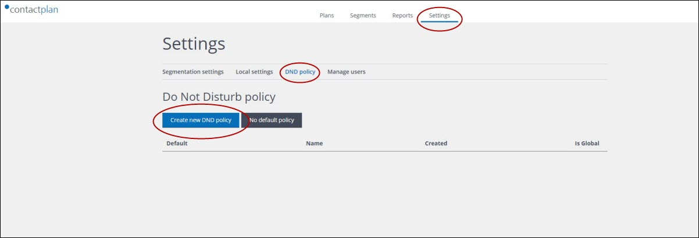
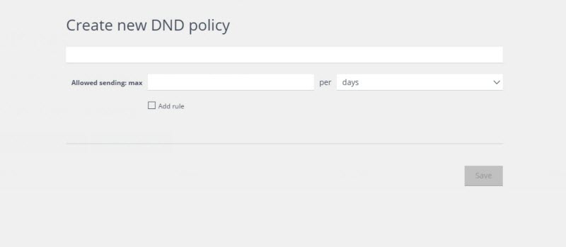
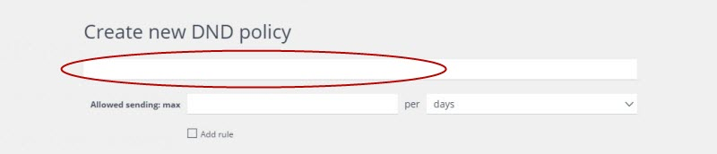
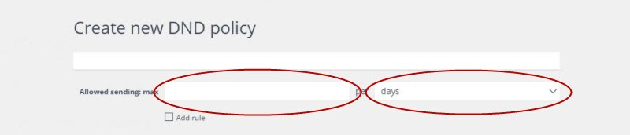
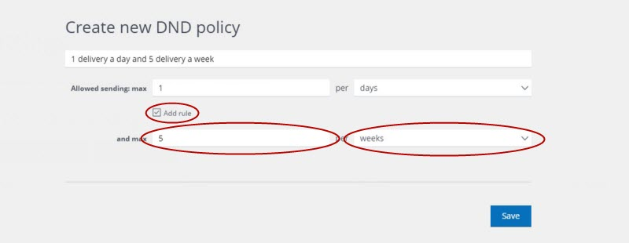
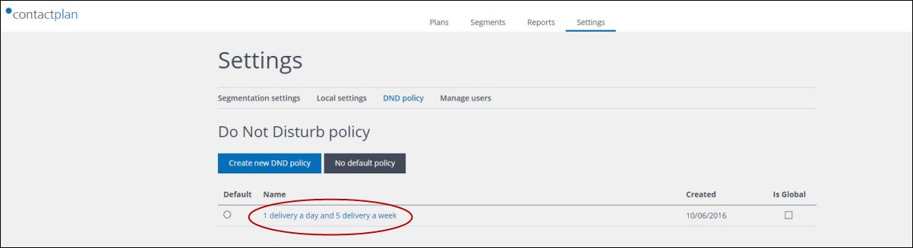
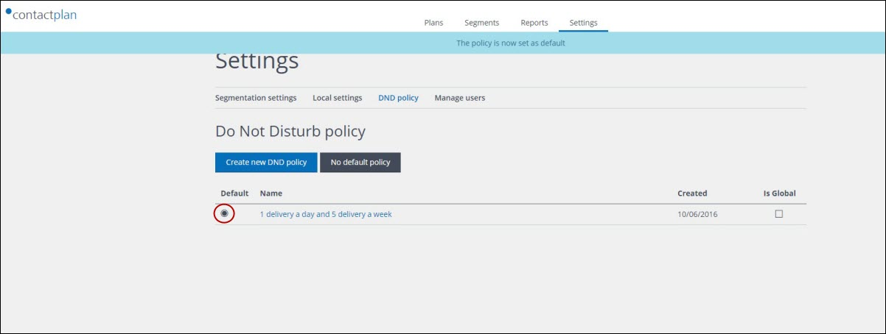

# Creating a new Do Not Disturb Policy

## Overview  

A DND policy is defined by creating one or more quantity and time-based delivery rules, for example, allow a maximum of one delivery each day and up to five deliveries each week. These rules are then used to filter the contacts belonging to the relevant segment, when a plan is run. 

## Creating a DND policy  

Do the following:  

- Click the **Settings** tab in the **navigation bar** on the **Contactplan UI start** page
- Click the **DND policy** tab on the **Settings** page  
  The **Do Not Disturb policy** page displays.  

  
**The Do Not Disturb policy page**  

- Click **Create new DND policy**  
  The **Create new DND policy** page displays.  

  
**The Create new DND policy page**  

- Enter a name for the policy in the box under the page title  

  
**The DND policy name box**  

- Under **Allow sending: max**, add a rule that defines how many deliveries are allowed in a given time period   

  
**The DND policy rule boxes**  

- To define a second rule, click the **Add rule** checkbox and add a second rule under **and max**  

  
**The additional DND policy rule boxes**

- When your DND policy is complete, click **Save**  
  You are returned to the **Do Not Disturb policy** page and the new policy is added to the list.  

  
**The Do Not Disturb policy page with a new policy added to the list**  

- To set the policy as the default DND policy, meaning the one that is automatically applied to each new plan, click the radio button in the **Default** column of the **Do Not Disturb policy** list

  
**The default policy radio button in the Do Not Disturb policy list**  

To re-open a policy once it has been saved, click its name in the list on the **Do Not Disturb policy** page.  

***Next page:***  
[Signing out](SigningOut.md)  

----------

## Related Pages:  

* [Signing in for the first time](FirstSignIn.md)  
* [Selecting a database](SelectingDatabase.md)  
* [Creating a new segment](CreatingNewSegment.md)  
* [Creating a new plan](CreatingNewPlan.md)  
* [Signing out](SigningOut.md)  

### Other links:  

* [Contactplan Quick Start Guide](README.md)  
* [Glossary](Glossary.md)  