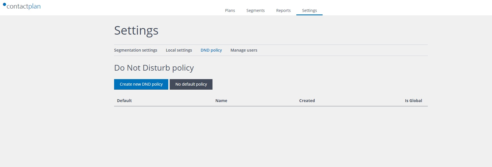
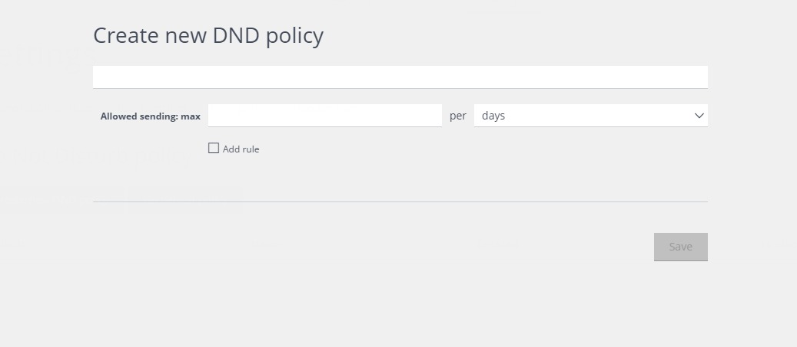
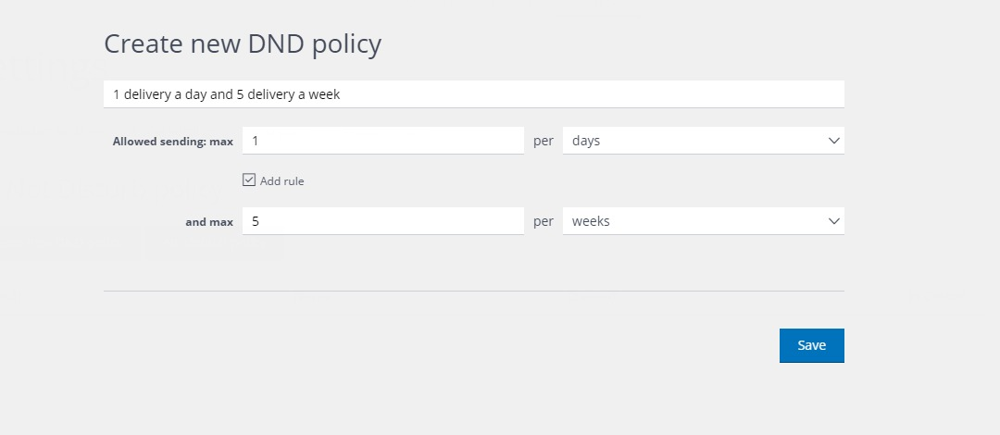
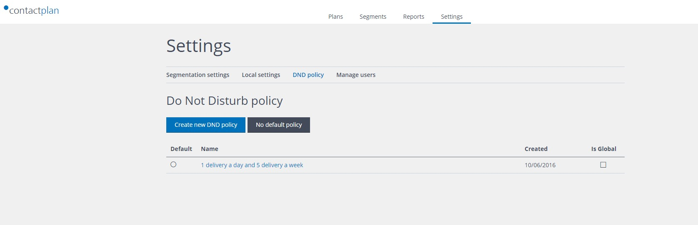
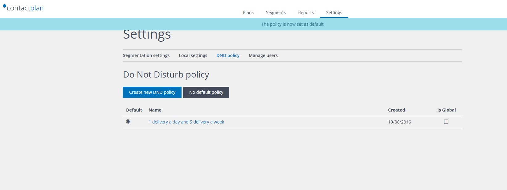

# Creating a new Do Not Disturb Policy

A Do Not Disturb (DND) policy is defined by by creating one or more quantity and time-based delivery rules, which are applied to the contacts in the relevant segment when a plan is run. For example, allow a maximum of one delivery each day and up to five deliveries in a week.

To create a new DND policy, select on the navigation bar "Setting" and then "DND policy". If, no DND policy have been already created, the page will look like this:

To create a new DND policy, selete "Create new DND policy".

Insert a name for the policy and the rule of the policy, i.e. how many deliveries are allowed in the given time period.
To add a second rule, check the "Add rule" button.
To save the policy, click on the "Save" button.

The saved rule will be shown in the DND policy list:

You can set the policy as the default DND policy, i.e. the policy that will be automatically selected in each new Plan, checking the left button "Default".

Next Page: [Sign Out](sign_out.md)

Related pages:
* [First Sign In](first_sign_in.md) 
* [Selecting the Database](selecting_the_database.md)
* [Creating a new Segment](creating_a_new_segment.md)
* [Creating a new Plan](creating_a_new_plan.md)
* [Creating a new Do Not Disturb policy](creating_a_new_do_not_disturb_policy.md)
* [Sign Out](sign_out.md)