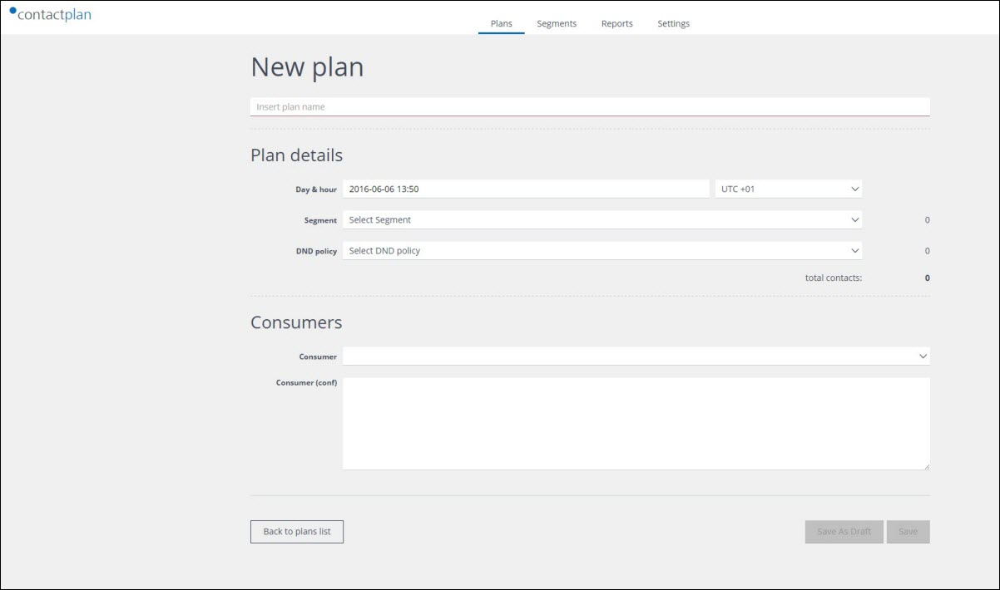
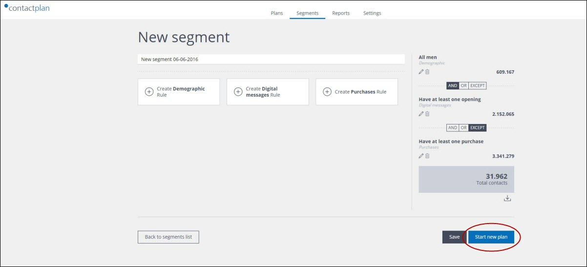
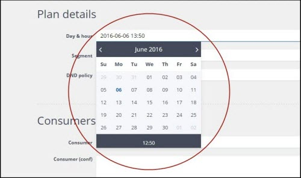
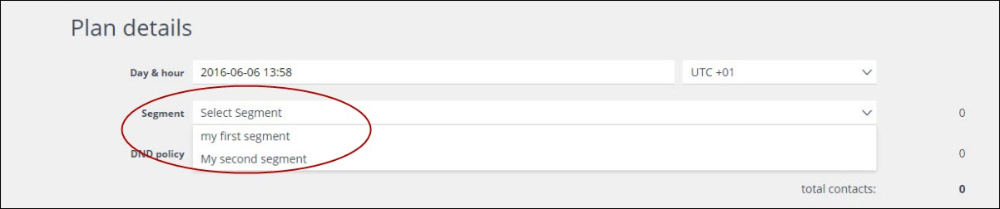
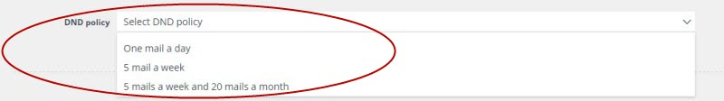
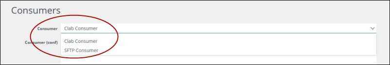
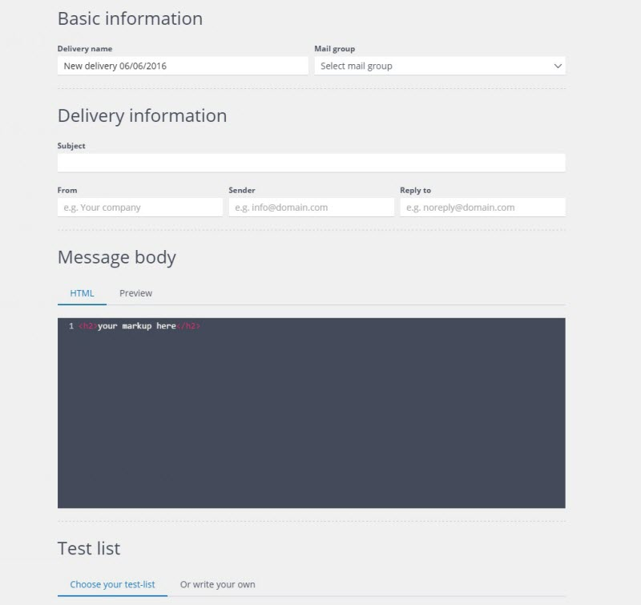
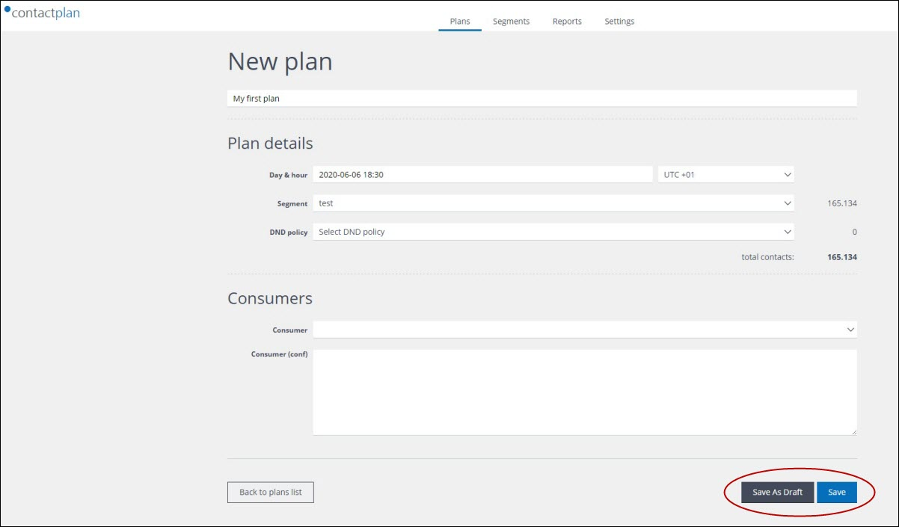
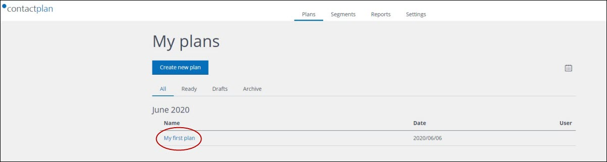

# Creating a new plan

## Overview  

A plan is made up of all of the information that is required to use the contacts identified in a segment as, for example, the target audience for mailing activities. As a minimum, a plan contains:

- Details about when the plan should be carried out  
- The relevant segment  
- The platform or **consumer**, external to Contactplan, which is to receive the list of contacts    

A plan can also include additional elements, such as the appropriate Do Not Disturb (DND) policy, test email addresses and further options.  

### The contact list and consumers  

The end result of a scheduled plan is a **contact list**. This list can be stored in the system for downloading in the future, or sent for further processing to a **consumer** such as:

- An SFTP folder  
- Contactsend, for onward delivery  

See the *Contactplan User Guide* and the *Contactplan Product Overview* for more about plans.  

## Creating a plan  

There are two ways to start creating a plan. Do one of the following: 

- Click the **Plans** tab in the **navigation bar** on the **Contactplan UI start** page  
  The **My plans** page displays.  

  
**The My plans page**  

- Click **Create new plan**  
  The **New plan** page displays.  

  
**The New plan page**  
  
  or:  
  
- Once you have finished the rules that define a segment, click **Start new plan**, positioned towards the bottom right of the **New segment** page  
  The **New plan** page displays.  
  See [Creating a new segment](CreatingNewSegment.md) for more about the **New segment** page.  

  
**The New segment page showing the Start new plan button**  

Once you have arrived at the **New plan** page, the steps are generally the same. Do the following:

- Click the **Insert plan name** field, positioned under the page title, and enter a name for the plan  
- Under **Plan details**, click the first box next to **Day & hour**  
  The **Calendar** widget displays.  

  
**The Calendar widget**  

- Use the calendar controls to select the appropriate date and time to run the plan  
- Under **Segment**, click the downwards pointing arrow to the right of the box marked **Select segment**, and select the appropriate segment from the drop-down list  
  **Note:**  
  If you arrived at the **New plan** page from the **New segment page**, you can ignore this step as the segment is automatically selected for you.  

  
**The segments drop-down list**  

### Adding a DND policy

If you want to add a DND policy to your plan, do the following:  

- Under **DND policy**, click the downwards pointing arrow to the right of the box marked **Select DND policy**, and select the appropriate policy from the drop-down list  

  
**The DND policy drop-down list**  

**Note:**  
If there are no policies in the drop-down list, you can create a new one. See [Creating a new Do Not Disturb policy](CreatingNewDND.md) and the *Contactplan User Guide* for more details.  

### Adding a consumer  

Do the following:  

- Under **Consumers**, click the the downwards pointing arrow to the right of the box labeled **Consumer** and select the required option from the drop-down list  
  - **Clab Consumer**  
   Enables you to create a delivery using Contactsend.  
  - **SFTP Consumer**  
   Saves the **contacts list**, generated according to the segment and any applicable DND policy, to an SFTP server that has previously been configured by Contactlab.  

  
**The Consumer drop-down list**  

If you select **Clab Consumer**, a new window displays, which enables you add all the information that is required to create a delivery using Contactsend. For example, you can use whichever editor you choose to create the HTML code that defines the content for your email delivery, then copy and paste it into the HTML box provided under **Message body.** The system does the rest.  

  
**The Clab Consumer page**  

## Completing your plan

When you have defined your new plan, it can be saved:  

- As a **Draft**  
  Nothing further happens with the plan, but your work is saved.  
  or:  
- As **Ready**  
  On the target date, the plan is run using the selected **consumer**.

Do the following: 

- At the foot of the **New plan** page, click either:  
  - **Save as Draft**  
   Saves the plan for future changes.  
   or:  
  - **Save**   
   Saves the plan as ready.  

**The save buttons on the New plan page**

When you save your plan, you are returned to the **My plans** page and the new plan is added to the list.  

**The My plans page with a new plan added to the list**  

To re-open a plan once it has been saved, click its name in the list on the **My plans** page.  

***Next page:***  
[Creating a new Do Not Disturb policy](CreatingNewDND.md)  

----------

## Related Pages:  

* [Signing in for the first time](FirstSignIn.md)  
* [Selecting a database](SelectingDatabase.md)  
* [Creating a new segment](CreatingNewSegment.md)  
* [Creating a new Do Not Disturb policy](CreatingNewDND.md)  
* [Signing out](SigningOut.md)  

### Other links:  

* [Contactplan Quick Start Guide](README.md)  
* [Glossary](Glossary.md)  