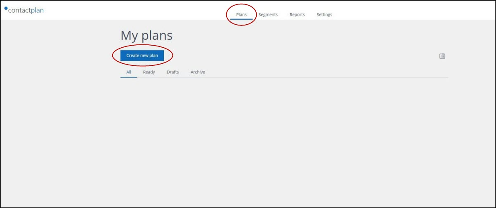

# Creating a new plan

## Overview  

A plan is made up of all of the information that is required to use the contacts identified in a segment as, for example, the target audience for mailing activities. As a minimum, a plan contains details about when it should be carried out, the relevant segment and the platform or **consumer**, external to Contactplan, which is to receive the list of contacts.    

A plan can also include additional elements, such as the appropriate Do Not Disturb (DND) policy, test email addresses and other options.  

See the *Contactplan User Guide* and the *Contactplan Product Overview* for more about plans.  

## Creating a plan  

There are two ways to start creating a plan. Do one of the following: 

- Click the **Plans** tab in the **navigation bar** on the **Contactplan UI start** page  
  The **My plans** page displays.  

  
**The My plans page**  

- Click **Create new plan**  
  The **New plan** page displays.  

  
**The New plan page**  

  or:  
  
- Once you have finished the rules that define a segment, click **Start new plan**, positioned towards the bottom right of the **New segment** page  
  The **New plan** page displays.  
  See [Creating a new segment](CreatingNewSegment.md) for more about the **New segment** page.  

  
**The New segment page showing the Start new plan button**  

Once you have arrived at the **New plan** page, the steps are generally the same. Do the following:

- Click the **Insert plan name** field, positioned under the page title, and enter a name for the plan  
- Under **Plan details**, click the first box next to **Day & hour**  
  The **Calendar** widget displays.  

  
**The Calendar widget**  

- Use the calendar controls to select the appropriate date and time to run the plan  
- Under **Segment**, click the downwards pointing arrow to the right of the box marked **Select segment**, and choose the appropriate segment from the drop-down list  
  **Note:**  
  If you arrived at the **New plan** page from the **New segment page**, you can ignore this step as the segment is automatically selected for you.  

  
**The drop-down list of segments**  

**HEREHEREHERE**

To add a Do Not Disturb policy, click on the DND policy field, the system will show all the available policies. You can choose one by selecting it. If no DND policies are shown, you can create a new one in "Settings" page and then enter the "DND Policy" page.

The result of a scheduled plan is the generation of a Contact List. This List can be either stored in the system for future downloand or send to an sFTP folder or sent to Contactlab delivery platform for email or SMS delivery. When you create a new Plan, in the "Consumer" tab, you can choose how to use the Contact List generated by the Plan.

When you select "SFTP Consumer", the system will save the Contacts List generated by the segment (and by the DND policy) into a SFTP server. The sFTP server has been previously configured by Contactlab Operator.

When you select "Clab Consumer", the system will display additional fields where you can insert all the required information to create a delivery within Contactlab delivery platform. In the HTML box, you can paste the HTML for your email delivery; this HTML can be created with whatever editor you like.

When you complete the new plan, or you need a break, you can save it either as Draft (nothing happens but all the work so far is saved in the system) or Ready (at the target date, the plan is executed accordingly to the selected Consumer).

After saving, your plan will appear in the Plans page.

you can click on the Plan's name to open it to see the details or to modify it.

Next Page: [Creating a new Do Not Disturb policy](creating_a_new_do_not_disturb_policy.md)

Related pages:
* [First Sign In](first_sign_in.md) 
* [Selecting the Database](selecting_the_database.md)
* [Creating a new Segment](creating_a_new_segment.md)
* [Creating a new Plan](creating_a_new_plan.md)
* [Creating a new Do Not Disturb policy](creating_a_new_do_not_disturb_policy.md)
* [Sign Out](sign_out.md)