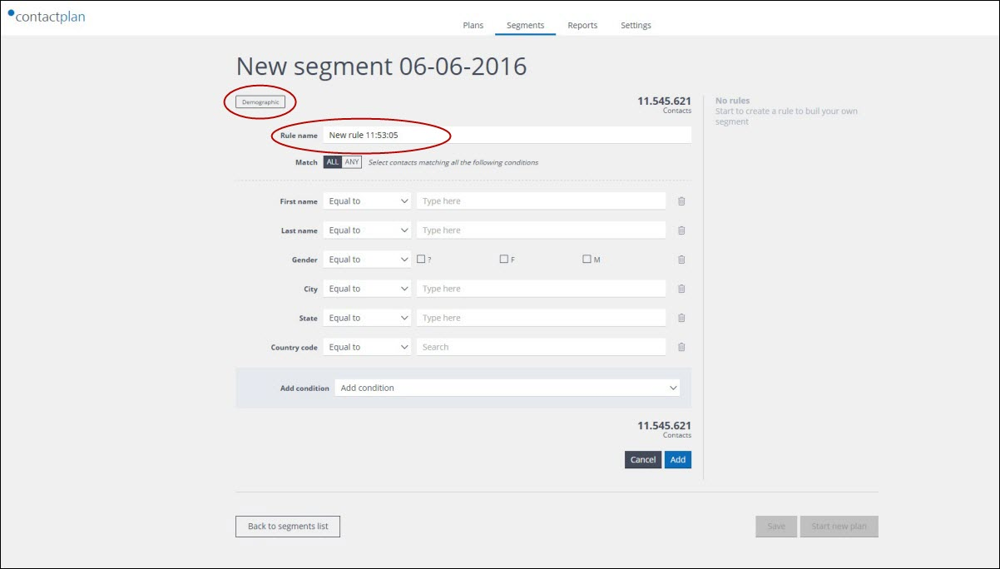

# Creating a new segment

## Overview  

A **segment** is created by defining a set of **conditions**. These are then combined using **logical operators** and applied to a given database. Contacts satisfying the defined conditions, at the point in time that they are applied to the database, are selected by the segment. It is important to understand, however, that the same segment can select another set of contacts at a different point in time.   

Conditions are organized into **rules**. Each segment contains at least one rule. Each rule comprises of a set of conditions that are applied to a particular type of data, such as **Demographic data**, **Digital Messages data** or **Purchases data**.  

See the *Contactplan User Guide* and the *Contactplan Product Overview* for more about segments.  

## Creating a segment

Once you have signed in to Contactplan, do the following:

- Click the **Segments** tab on the **Contactplan UI start** page  
  The **My segments** page displays.  

  
**The My segments page**  

- Click **Create new segment**  
  The **New segment** page displays.

  
**The New segment page**

This is the starting point for adding the rules and the associated conditions that define the required segment. You can freely mix and combine rules and rule types to create your target segment.  

Do the following:

- You can choose to accept the system generated **segment name**, or define your own. To define your own: 
  - Click the **segment name** field, positioned under the page title  
  - Enter the required name  

  
**The segment name**  

- Click **Create Demographic Rule**, **Create Digital messages Rule** or **Create Purchases Rule** to start to define your first rule. 
  **Note:**  
  For the purpose of this example, a **Demographic rule** is created.  

  
**The rule types**  

The **Create Demographic Rule** page displays, with **My favorite rules** highlighted by default. 

  
**The Create Demographic Rule page**  

- Select one of the available options to create a rule:
  - **My favorite rules**  
   Preset rules that you have selected as your favorites. This is empty until you select the relevant preset rule/s. 
  - **Create custom rule**  
   Provides access to all of the available fields in the database.  
  - **Preset rules**  
   Pre-configured rules that can be used as building blocks for your segment. This may be empty if you have signed in for the first time.  

  For the purposes of this example, a **Custom rule** is created.  

- Click **Create custom rule**  
  The **New demographic custom rule** page displays, showing the **segment name** as its title.  

  
**The New demographic custom rule page**  

- You can choose to accept the system generated **rule name**, or define your own. To define your own:  
  - Click the **Rule name** field, positioned under the page title  
  - Enter the required name  
- Define the required condition/s using the appropriate fields. 
  To define, for example, the parameters for the **Last name** of a contact:   
  - Click the downwards pointing arrow to the right of the first box, and select the appropriate operator, for example, **Not equal to**, from the drop-down list  
   See the *Contactplan User Guide* for more about operators.  
  - Enter the required last name, for example, *Smith*, in the **Free text** field  
   The system automatically displays the number of contacts in the database that match the condition.  

  
**The New demographic custom rule page displaying the number of selected contacts**  

- Define further conditions if required  
  **Note:**  
  You can add other conditions to the **New demographic custom rule** page by clicking the downwards pointing arrow to the right of the **Add condition** box, and selecting the appropriate condition.   
- When you have defined all the conditions for the rule, click **Add**  
  The **New demographic custom rule** page closes and the new rule displays in the **Rule list** area of the **Summary panel**, on the **New segment** page.  

  
**The Rule list area of the Summary panel on the New segment page**  

- You can add further rules by repeating the above steps as required. 
- When you have more than one rule, you can define how the rules are combined by using the **AND**, **OR** or **EXCEPT** interaction conditions in the **Rule list** area of the **Summary panel**
  See the *Contactplan User Guide* for more about interaction conditions.  

  
**The interaction conditions in the Rule list area of the Summary panel**  

- When your segment is complete, click **Save**  
  You are returned to the **My segments** page and the new segment is added to the list.  

  
**The My segments page with a new segment added to the list**  

To re-open a segment once it has been completed, click its name in the list on the **My segments** page.  

***Next page:***  
[Creating a new Plan](CreatingNewPlan.md)  

----------

## Related Pages:  

* [Signing in for the first time](FirstSignIn.md)  
* [Selecting a Database](SelectingDatabase.md)  
* [Creating a new Plan](CreatingNewPlan.md)  
* [Creating a new Do Not Disturb policy](CreatingNewDND.md)  
* [Signing out](SigningOut.md)  

### Other links:  

* [Contactplan Quick Start Guide](README.md)  
* [Glossary](Glossary.md)  