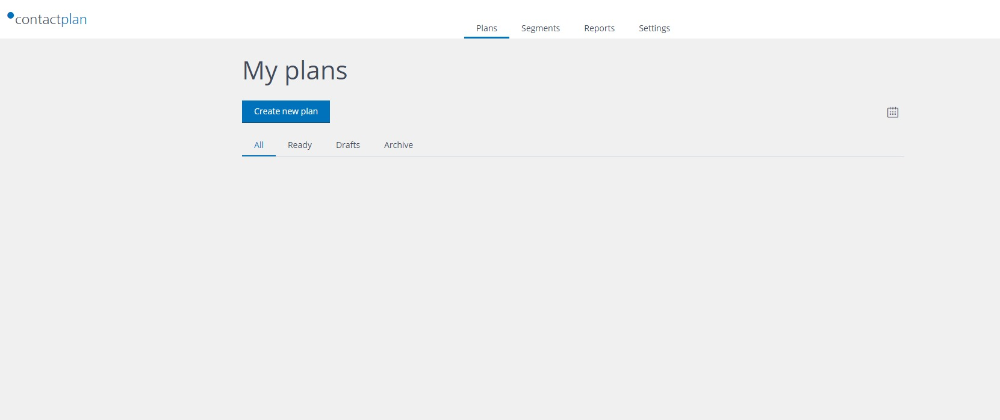

# First Sign In

In order to sign in to Contactplan, just open your browser and type the following URL:

[https://cplan.contactlab.it](https://cplan.contactlab.it)

**Note: the supported browser at the time of writing are:
* Google Chrome version 50 or later**

The browser shows the Account Central page where you can insert your credentials to access Contactplan. To access Contactplan please use the credentials you have received from Contactlab.

If you are already a users of Contactlab platform and you have been enabled to use Contactplan, then you can sign in with the same credentials used to access Contactlab platform.

Once you enter the correct username and password, you have access to Contactplan.
At first login, the home page looks like this: 

Next page: [Selecting the Database](selecting_the_database.md)

Related pages:
* [First Sign In](first_sign_in.md)
* [Selecting the Database](selecting_the_database.md)
* [Creating a new Segment](creating_a_new_segment.md)
* [Creating a new Plan](creating_a_new_plan.md)
* [Creating a new Do Not Disturb policy](creating_a_new_do_not_disturb_policy.md) 
* [Sign Out](sign_out.md)

