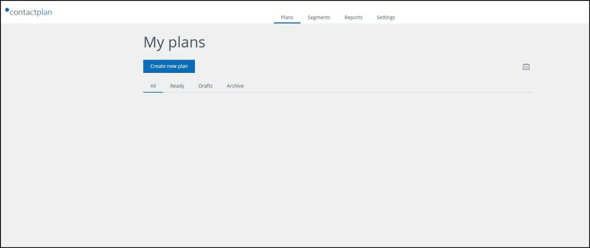

# Signing in for the first time

To sign in to the Contactplan UI, do the following:  

- Open your web browser  
  **Note:**  
  The current version of Contactplan supports Google Chrome 50.0 and later.  
- Enter the following URL:  
  [https://cplan.contactlab.it](https://cplan.contactlab.it)  
  The **Contactlab log-in** page displays.  

  
**The Contactlab log-in page**  

- Enter the **Username** and **Password** that you received from Contactlab  
  **Note:**  
  You can sign in with your Contactsend credentials, if you are already a Contactsend user and Contactplan has been enabled for your account.  
- Click **SIGN IN**  
  The **Contactplan UI start** page displays.  

  
**The Contactplan UI start page**  

***Next page:***  
[Selecting a Database](SelectingDatabase.md)  

----------

## Related Pages:  

* [Selecting a database](SelectingDatabase.md)  
* [Creating a new segment](CreatingNewSegment.md)  
* [Creating a new plan](CreatingNewPlan.md)  
* [Creating a new Do Not Disturb policy](CreatingNewDND.md)  
* [Signing out](SigningOut.md)  

### Other links:  

* [Contactplan Quick Start Guide](README.md)  
* [Glossary](Glossary.md)  