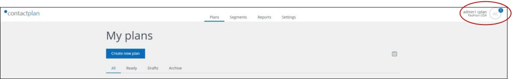

# Selecting a database

  
**The Username and database name**  

The upper right corner of the Contactplan UI displays your **Username** and the name of the database that is available for you to use.  

If you are authorized to use more than one database, you can change to a different one as follows:  

- Click your **Username**  
  The **Settings** and **Sign out** buttons display.  

  
**The Settings and Sign out buttons**  

- Click **Settings**  
  The **Settings** page displays.  

  
**The Settings page**  

- Under **Tenant**, click the downwards pointing arrow to the right of the name of the current database, and select the new database from the drop-down list.  
  The selected database is loaded automatically.  

***Next page:***  
[Creating a new segment](CreatingNewSegment.md)  

----------

## Related Pages:  

* [Signing in for the first time](FirstSignIn.md)  
* [Creating a new segment](CreatingNewSegment.md)  
* [Creating a new plan](CreatingNewPlan.md)  
* [Creating a new Do Not Disturb policy](CreatingNewDND.md)  
* [Signing out](SigningOut.md)  

### Other links:  

* [Contactplan Quick Start Guide](README.md)  
* [Glossary](Glossary.md)  