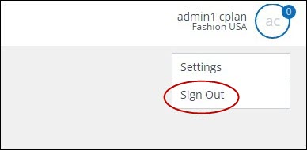

# Signing out

  
**The Username and database name**  

The upper right corner of the Contactplan UI displays your **Username** and the name of the database that is available for you to use.  

To sign out of Contactplan, do the following:  

- Click your **Username**  
  The **Settings** and **Sign out** buttons display.  

  
**The Settings and Sign out buttons**  

- Click **Sign Out**  

***Next page:***  
[Contactplan Quick Start Guide](README.md)  

----------

## Related Pages:  

* [Signing in for the first time](FirstSignIn.md)  
* [Selecting a database](SelectingDatabase.md)  
* [Creating a new segment](CreatingNewSegment.md)  
* [Creating a new plan](CreatingNewPlan.md)  
* [Creating a new Do Not Disturb policy](CreatingNewDND.md)  

### Other links:  

* [Contactplan Quick Start Guide](README.md)  
* [Glossary](Glossary.md)  