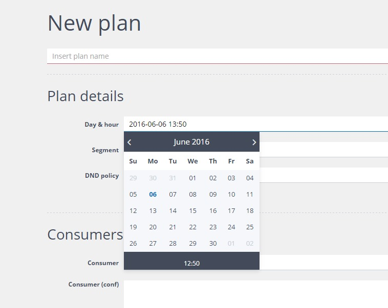
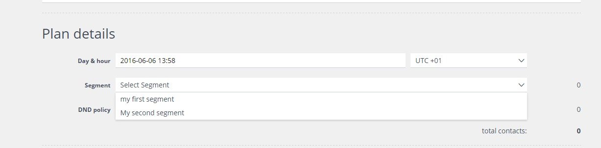
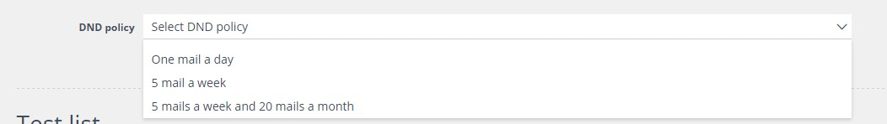
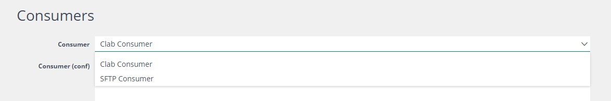
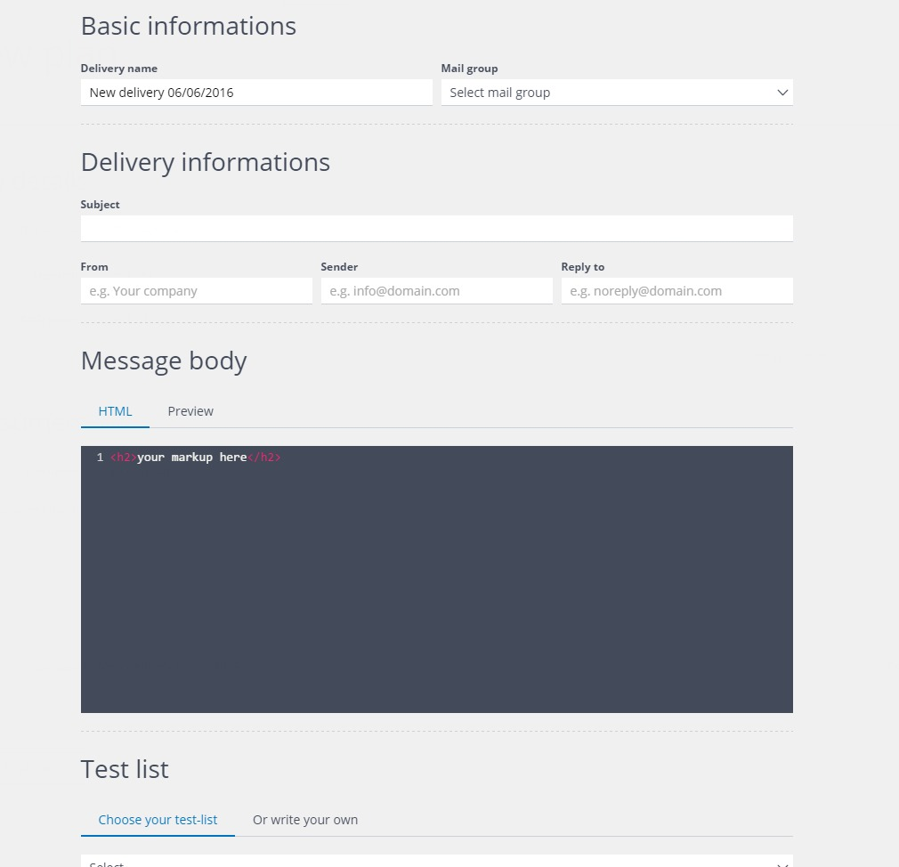
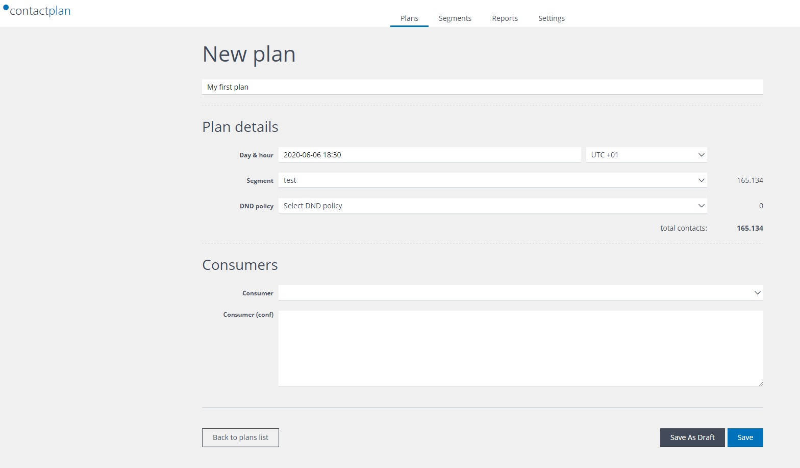
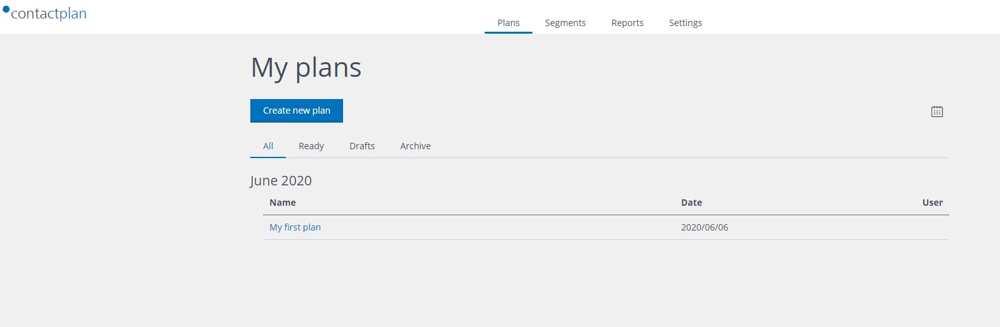

# Creating a new Plan

From the navigation bar, select the tab Plans to access the Plans page. At first login, the Plans page appear like this:

To create a new Plan, click on "Create new plan". The following page will be displayed.

To complete a Plan, at least the following information must be filled:
* plan's name
* target date of plan's execution
* target audience of the plan, i.e. the segment 

You can modify the target date simply clicking on the date field, a calendar will appear to select the new date and hour.

To select the target segment, click on the "Select segment" field; the system will show all the available segments. you can choose the target one by selecting it. Alternatively, you can start a new plan directly from your target segment clicking on the Tab "Start new plan".

To add a Do Not Disturb policy, click on the DND policy field, the system will show all the available policies. You can choose one by selecting it. If no DND policies are shown, you can create a new one in "Settings" page and then enter the "DND Policy" page.

The result of a scheduled plan is the generation of a Contact List. This List can be either stored in the system for future downloand or send to an sFTP folder or sent to Contactlab delivery platform for email or SMS delivery. When you create a new Plan, in the "Consumer" tab, you can choose how to use the Contact List generated by the Plan.

When you select "SFTP Consumer", the system will save the Contacts List generated by the segment (and by the DND policy) into a SFTP server. The sFTP server has been previously configured by Contactlab Operator.

When you select "Clab Consumer", the system will display additional fields where you can insert all the required information to create a delivery within Contactlab delivery platform. In the HTML box, you can paste the HTML for your email delivery; this HTML can be created with whatever editor you like.

When you complete the new plan, or you need a break, you can save it either as Draft (nothing happens but all the work so far is saved in the system) or Ready (at the target date, the plan is executed accordingly to the selected Consumer).

After saving, your plan will appear in the Plans page.

you can click on the Plan's name to open it to see the details or to modify it.

Next Page: [Sign Out](sign_out.md)

Related pages:
* [First Sign In](first_sign_in.md) 
* [Selecting the Database](selecting_the_database.md)
* [Creating a new Segment](creating_a_new_segment.md)
* [Creating a new Plan](creating_a_new_plan.md)
* [Creating a new Do Not Disturb policy](creating_a_new_do_not_disturb_policy.md)
* [Sign Out](sign_out.md)