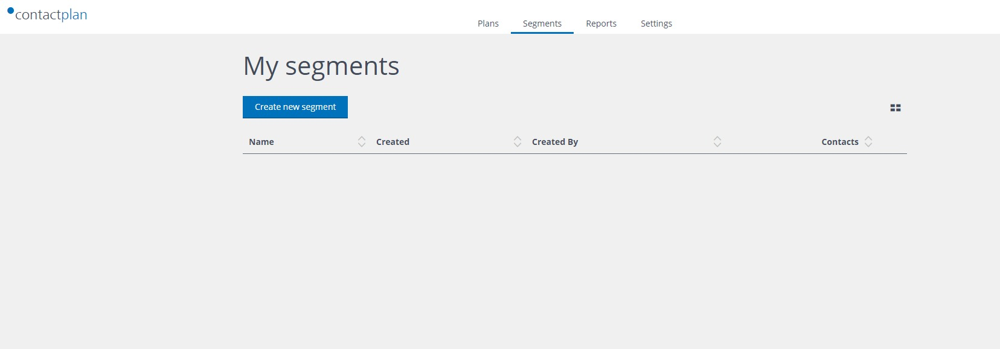
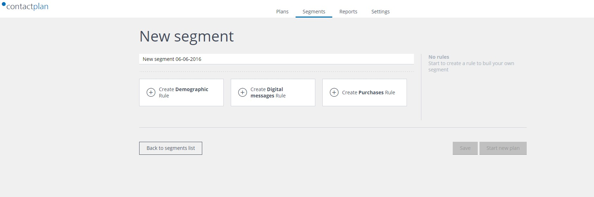
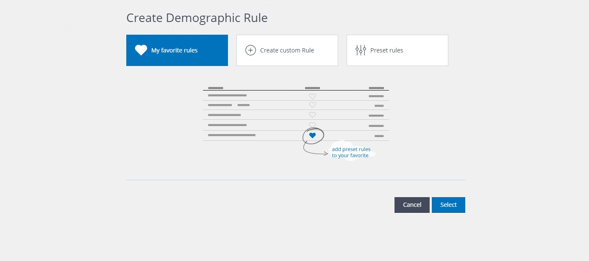
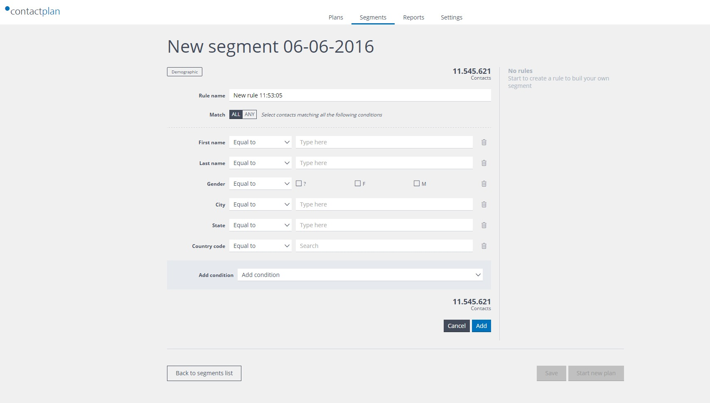
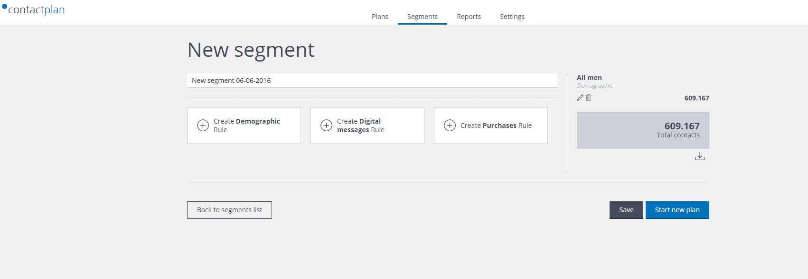
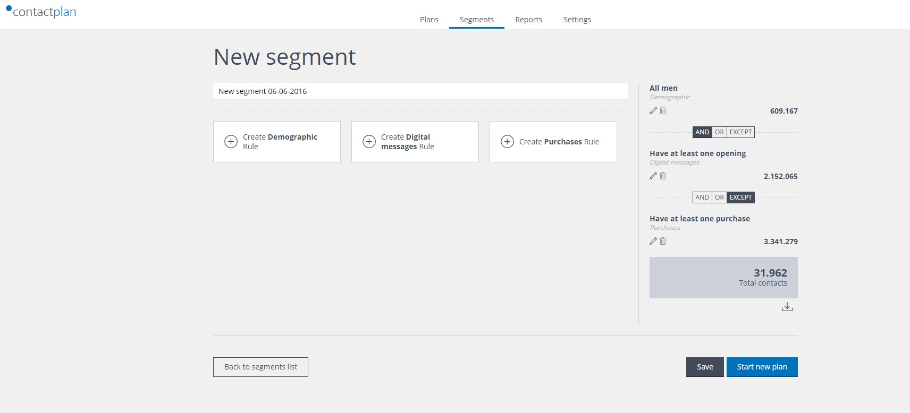
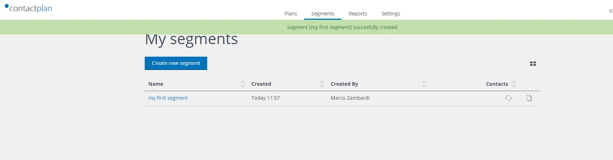

# Creating a new Segment

Segment is a set of conditions combined togheter by means of logic operator and applied over a given database. Contacts satysfing the conditions are selected by the segment. Note that the same segment can select different set of contacts in different moment in time. 
Conditions are organized in Rules, each segment contains at least one Rule. Each Rule expresses a set of conditions about a given type of data, e.g. Demographic data.
For more information about Segment, please refer to Contactplan "how to" guide and to other available documentation.

At first login, the Segment page appears like this:

To start creating your own segments, just click on "Create new segment" tab. The following page will be displayed.

Here you can assign a name to the new segment and starting adding Rules to segment related to a given type of data, data can be Demographic data, Digital Messages data and Purchase data.
Each Rule is a set of conditions upon a given type of data; you can mix freely Rules to create your target segment.

Click on a Tab to create a Rule, you can choose between Custom Rule and Preset Rule.
Custom Rules give access to all the available fields in the database, Preset Rule are pre-configured rules that you can use as building blocks for your segment. Preset rules library may be empty at the very first login.

To start, click on Custom Rule:

When you complete a Rule, you can assign it a name and add it to the segment by clicking "Add"; the Rule will be added to the segment on the right summary.

if you want to add further rules, repeat all the above steps as needed. When you have more than one Rule, you can set directly from the right summary, how the different Rules  combine togheter as shown in the following picture.

When your segment is completed, click Save to add it to the system. 

To re-open it, just click on the segment's name.

Next page: [Creating a new Plan](creating_a_new_plan.md)

Related pages:
* [First Sign In](first_sign_in.md) 
* [Selecting the Database](selecting_the_database.md)
* [Creating a new Segment](creating_a_new_segment.md)
* [Creating a new Plan](creating_a_new_plan.md)
* [Creating a new Do Not Disturb policy](creating_a_new_do_not_disturb_policy.md)
* [Sign Out](sign_out.md)