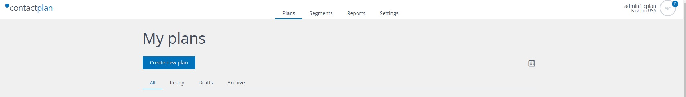
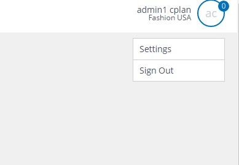
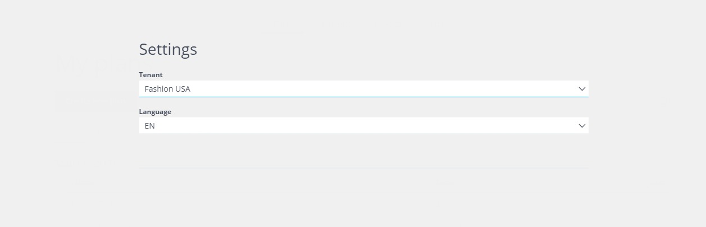

# Selecting the database

The upper right corner of the UI shows the username of the logged user and the database name on which the user can operate.

If you are authorized to operate on more than one database, you switch database by clicking on your username in the upper right corner and then selecting settings.

 
You can select the database from the drop down menu labelled "Tenant".